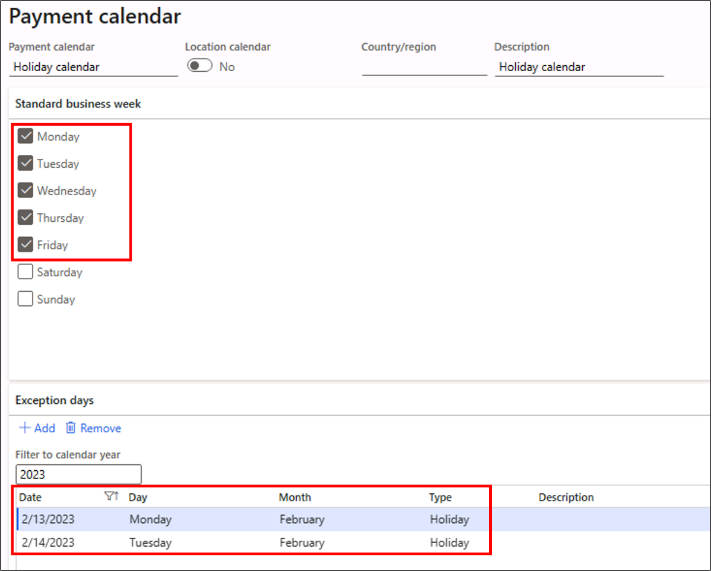
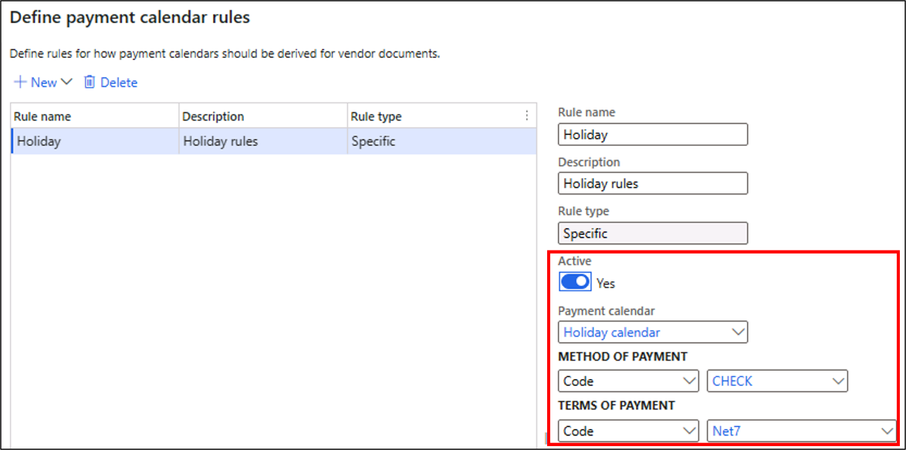
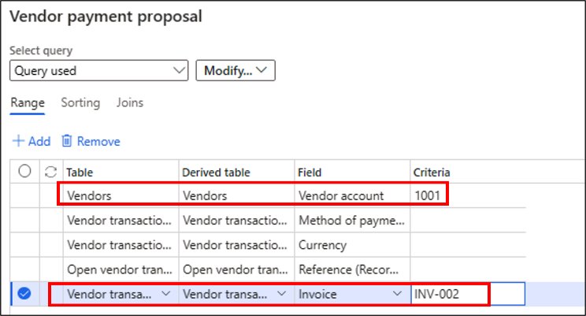
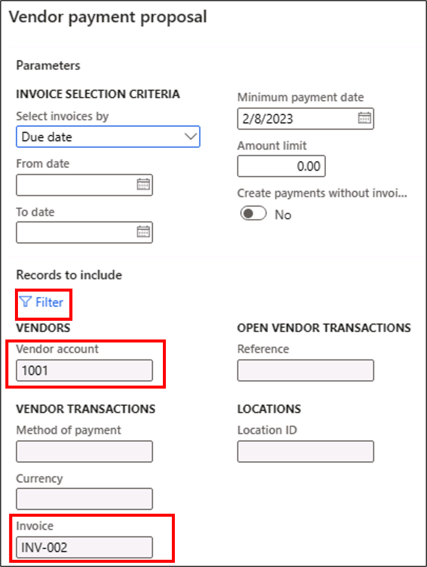

---
lab:
    title: 'Lab: Apply payment terms and schedule'
    module: 'Module 3: Implement and manage accounts payable and expenses'
---

# Objective

The objective of this lab is to calculate the due date of payment of an invoice based on different payment setup, like payment terms, payment days, and payment calendar. You will also check the impact of a payment fee and cash discount when you post a payment journal.

Open your Dynamics 365 Finance environment and change the legal entity to USMF.

## Exercise 1: Enter payment terms

1. Navigate to **Accounts payable &gt; Payment setup** and open **Terms of payment**.

2. Create a new record in Terms of payment by selecting the **+New** button. Enter these values in the following fields:

	- **Term of payment**: Net7

	- **Description**: Net 7 days

	- **Payment method**: Net

	- **Days**: 7

	

 

## Test scenario 1

1. Navigate to **Accounts payable &gt; Invoices** and open **Pending vendor invoices**.

2. Create a new record pending vendor invoice by selecting the **+New** button in the action pane. Enter the values in the following fields:

	- **Invoice account**: 1001

	- **Number**: INV-001

	- **Invoice date**: [Current date]

3. Select the **Header** tab and navigate to the **Payment** FastTab.

4. Select Net7 in the **Terms of payment** field. The **due date** will change to 7 days from the current date.

 

## Exercise 2: Enter payment days

1. Navigate to **Accounts payable &gt; Payment setup** and open **Payment days**.

	Create a new record in **Payment days** by selecting the **+New** button. The **Payment day** will be Wednesday and the **Description** will be Payment on Wednesday. In the **Payment day** lines Add Week in the **Week/Month** column and Wednesday in the **Day of week** column.

	

3. Navigate to **Accounts payable &gt; Payment setup,** open **Terms of payment** and navigate to record Net7. Enter Wednesday in the **Payment day** field of **Terms of payment**.

## Test scenario 2

1. Navigate to **Accounts payable &gt; Invoices** and open **Pending vendor invoices**.

2. Navigate to the record you just created in the **Pending vendor invoice** page, **Header** tab, **Payment** FastTab.

3. Re-enter Net7 in the **Terms of payment** field. If the existing due date is on a Wednesday, there won’t be any change in due date. For any other dates it will pick the following Wednesday.

For example:

| **Scenario**| **Invoice Date**| **Payment terms**| **Payment Days**| **Due date** |
| --- | --- | --- | --- | --- |
| 1| 02/07/2023| Net7| | 02/14/2023 |
| 2| 02/07/2023| Net7| Wednesday| 02/15/2023 |

## Exercise 3: Enter payment calendar

1. Navigate to **Accounts payable &gt; Payment setup** and open **Payment calendar**.

2. Create a new payment calendar by selecting the **+New** button in the action pane and enter the following values:

	- **Payment calendar**: Holiday

	- **Location calendar**: No

	- **Description**: Holiday calendar

	- **Standard business week**: Select Monday to Friday. Keep Saturday and Sunday unselected.

3. Enter two records in the Exception days section:

	- **Date**: [Monday & Tuesday of next week]

	- **Type**: Holiday for both the records

	

4. **Save** the record and close the page.

5. Navigate to **Accounts payable &gt; Payment setup,** open **Terms of payment** and navigate to record Net7. Select **Edit** to make the record editable. Change the **Due date update** field to **Next business day**. Clear the **payment day** field.

6. Navigate to **Accounts payable &gt; Payment setup,** open **Payment calendar configuration.**

7. Select the **+New** button and add the following, then **Create rule**:

	- **Rule name**: Holiday

	- **Description**: Holiday rules

	- **Rule type**: Specific

	

8. Enter values in the other fields:

	- **Active**: Yes

	- **Payment calendar**: Holiday calendar

	- **Method of payment**: Code / CHECK

	- **Terms of payment**: Code / Net7

	

 

9. **Save and close** the page.

 
## Test scenario 3

1. Navigate to **Accounts payable &gt; Invoices** and open **Pending vendor invoices**.

2. Navigate to the record you just created in the **Pending vendor invoice** page.

3. Re-enter the **Invoice date** field with Monday or Tuesday of the current week. The **due date** will be Wednesday of the following week even though the payment term is Net7.

For example:

| **Scenario**| **Invoice Date**| **Payment terms**| **Holiday in payment calendar**| **Due date** |
| --- | --- | --- | --- | --- |
| 3| 02/07/2023| Net7| 02/13/2023 02/14/2023| 02/15/2023 |

## Exercise 4a: Enter payment fee

1. Navigate to **Accounts payable &gt; Payment setup** and open **Payment fee**.

2. Create a new payment fee by selecting the **+New** button in the action pane and enter the following values:

	- **Fee ID**: Wire

	- **Name**: Wire Fee

	- **Charge**: Ledger

	- **Main account**: 403150

	- **Journal type**: Vendor disbursement

3. **Save** the record and select **Payment fee setup** in the action pane. Enter the following:

	- **Groupings**: Table

	- **Bank relation**: USMF OPER

	- **Method of payment**: ELECTRONIC

	- **Payment currency**: USD

	- **Percentage/Amount**: Amount

	- **Fee amount**: 10

	- **Fee currency**: USD

4. **Save and close** the page. Also close the **Payment fee** page.

 

## Exercise 4b: Enter Cash discount

1. Navigate to **Accounts payable &gt; Payment setup** and open **Cash discounts**.

2. Create a new record by selecting the **+New** button in the action pane. Type the following values:

	- **Cash discount**: 1.5%D3

	- **Description**: 1.5% 3 days

	- **Net/Current**: Net

	- **Days**: 3

	- **Discount percentage**: 1.5

	- **Main account for customer discounts**: 403300

	- **Discount offset accounts**: Use main account for vendor discounts

	- **Main account for vendor discounts**: 520200

 

3. **Save** the record and close the page.

 

## Test scenario 4

1. Navigate to **Accounts payable &gt; Invoices** and open **Pending vendor invoices**

2. Create a new record pending vendor invoice by selecting the **+New** button in the action pane. Enter the values in the following fields:

	- **Invoice account**: 1001

	- **Number**: INV-002

	- **Invoice date**: [Current date]

3. Select the **Header** tab and navigate to the **Setup** FastTab.

4. Select 1.5%D3 in the **Cash discount code** field.

5. Navigate to the **Payment** FastTab and select ELECTRONIC in the **Method of payment** field.

6. Navigate to the **Lines** tab, **+Add line**, and type the following in the **Lines** section:

	- **Procurement category**: Calculators or accessories

	- **Quantity**: 1

	- **Unit**: ea

	- **Unit price**: 3000

	- **Line net amount** (auto update): 3000 

7. Save the Vendor invoice by selecting the **Save** button in the action pane, followed by posting the Vendor invoice by selecting the **Post** button in the action pane.

 

8. Navigate to **Accounts payable &gt; Payments** and open **Vendor payment journal**.

9. Create a new journal by selecting the **+New** button in the action pane. Select VendPay in the **Name** field. Select the **Lines** button in the action pane and navigate to the journal lines.

10. Select **Create payment proposal** under the **Payment proposal** menu in the action pane.

	

11. In the **Vendor payment proposal** dialog, select the **Filter** button, and enter 1001 into the **Criteria** of the **Vendor account. +Add** a line, set the **Table** to Vendor transactions, **Field** to Invoice, and **Criteria** to INV-002. Select **OK**.

	

12. Your vendor payment proposal should show the selections you entered. Select the **OK** button.

	

13. You will be able to see the Invoice INV-002 of vendor 1001. If you select the **Cash discount** tab, you should be able to see the cash discount amount. 

	

	Select the **Due date** field on the **Invoices** tab and change it to the current date. Select the **Create payments** button in the bottom of the screen. 

 

14. You will be back to the **Vendor payments journal** with the invoice that you considered for payment as the journal line. The **Method of payment** should be ELECTRONIC. The date should be the current date.

	

 

15. You will find the cash discount is automatically deducted from the payable amount, as the payment date is less than three days ahead. Select the **Payment fee** tab and you will find the payment fee is automatically updated in the grid.

	

16. Post the transaction by selecting the **Post** button in the action pane.

17. Navigate to **General ledger &gt; Inquiries** **and reports** and select **Voucher transactions**.

18. Filter the records based on the current date, and select **OK**. You will find the payment, payment fee and cash discount transactions in the voucher transaction list.

	
